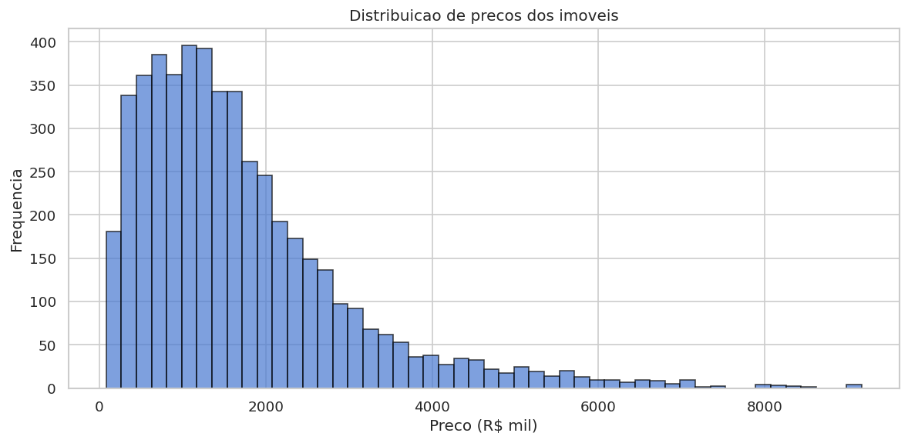
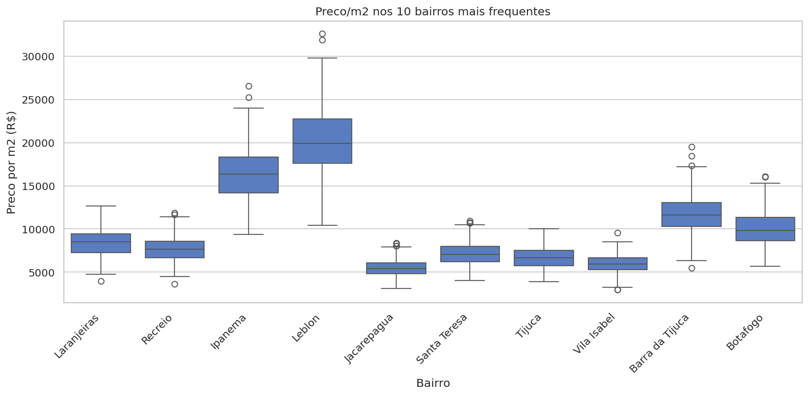
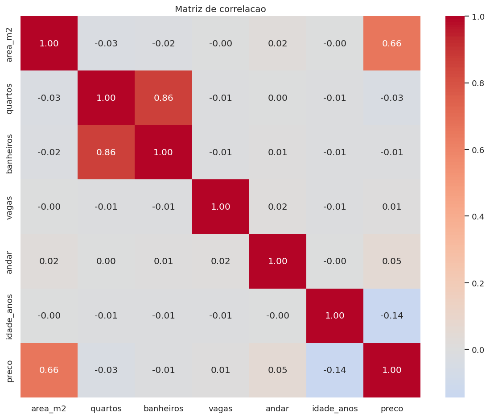

# 🏠 ImobIA — Análise e Previsão do Mercado Imobiliário do Rio de Janeiro

[](https://www.python.org/)
[](https://opensource.org/licenses/MIT)
[](https://streamlit.io/)
[](https://scikit-learn.org/)
[](https://xgboost.readthedocs.io/)

**Projeto end-to-end de ciência de dados** que cobre o ciclo completo: coleta, limpeza, análise exploratória, feature engineering, modelagem (supervisionada e não-supervisionada), tuning de hiperparâmetros, persistência e dashboard interativo.

---

## 📊 Resultados

| Modelo | MAPE | R² | RMSE |
|--------|------|------|------|
| Regressão Linear | 29.69% | 0.821 | R$ 397k |
| Random Forest | 14.12% | 0.903 | R$ 292k |
| Gradient Boosting | 14.47% | 0.908 | R$ 285k |
| XGBoost | 14.35% | 0.908 | R$ 285k |
| **LightGBM** ⭐ | **13.60%** | **0.910** | **R$ 281k** |
| XGBoost (Optuna tuned) | 14.28% | 0.912 | R$ 278k |

**Meta de MAPE < 15% atingida e superada.** O melhor modelo (LightGBM) erra em média 13.6% do preço — para um imóvel de R$ 1mi, prevê entre R$ 864k e R$ 1.14mi.

### 🔍 Principal insight de negócio

> Os indicadores socioeconômicos do bairro (**IDH + renda média**) explicam **54%** da variação de preços — quase o dobro da área do imóvel sozinha. A estratégia de enriquecer o dataset com dados do IBGE foi a decisão mais impactante do projeto.

---

## 🛠️ Stack Técnica

- **Linguagem:** Python 3.13
- **Análise:** pandas, NumPy
- **ML Supervisionado:** scikit-learn (Linear, RF, GB), XGBoost, LightGBM
- **ML Não-Supervisionado:** KMeans + PCA
- **Hyperparameter Tuning:** Optuna (busca bayesiana)
- **Persistência:** joblib
- **Visualização:** matplotlib, seaborn, Streamlit
- **Qualidade:** type hints, dataclasses, logging estruturado
- **Versionamento:** Git

---

## 🏗️ Arquitetura

```
ImobIA/
├── data/                  # raw / interim / processed / external
├── docs/                  # documentação por fase
├── notebooks/             # análises exploratórias
├── reports/figures/       # gráficos exportados
├── scripts/               # entrypoints (run_pipeline.py, sanity_check.py)
├── src/imobia/
│   ├── collect/           # coleta e enriquecimento de dados
│   ├── clean/             # limpeza e tratamento
│   ├── features/          # engenharia de features
│   ├── models/            # baseline, advanced, tuning, clustering
│   ├── viz/               # plots e dashboard Streamlit
│   ├── db/                # camada de banco
│   ├── llm/               # integração com Claude
│   ├── config.py          # variáveis de ambiente
│   ├── paths.py           # caminhos do projeto
│   └── logger.py          # logger estruturado
└── tests/                 # testes unitários
```

Cada módulo segue a convenção `DataFrame -> DataFrame`, permitindo encadear etapas como pipeline.

---

## 🚀 Como rodar localmente

### Pré-requisitos
- Python 3.13+
- Git

### Setup

```bash
# Clone o repositório
git clone https://github.com/nataliabarros1994/IMOBIA.git
cd IMOBIA

# Crie e ative ambiente virtual
python -m venv .venv
source .venv/bin/activate  # Linux/Mac
# .venv\Scripts\activate   # Windows

# Instale dependências
pip install -e ".[dev]"
```

### Executar o pipeline completo

```bash
# Gera dados, treina modelos, salva resultados
python scripts/run_pipeline.py
```

### Subir o dashboard interativo

```bash
streamlit run src/imobia/viz/dashboard.py
```

Acesse `http://localhost:8501` no navegador.

---

## 📷 Screenshots

### Dashboard interativo


### Distribuição de preços


### Preço/m² por bairro


### Matriz de correlação


---

## 🧪 Pipeline de Ciência de Dados

O projeto segue uma metodologia rigorosa em **8 fases**:

1. **Definição do Problema** — Perguntas de negócio claras (predição de preço, segmentação, bairros subvalorizados)
2. **Coleta de Dados** — Geração sintética + enriquecimento com indicadores IBGE
3. **Persistência** — Estrutura preparada para PostgreSQL via Docker
4. **Análise Exploratória** — Estatística descritiva, distribuições, correlações
5. **Modelos Supervisionados** — 5 modelos comparados (linear → boosting)
6. **Modelos Não-Supervisionados** — Segmentação de imóveis com K-Means + PCA
7. **Otimização** — Hyperparameter tuning com Optuna (busca bayesiana)
8. **Visualização & Deploy** — Dashboard Streamlit com predição interativa

---

## 🎯 Decisões Técnicas

- **Dataset sintético** para desenvolvimento sem dependência de APIs externas, com distribuição realista de preços por bairro do Rio.
- **Enriquecimento socioeconômico** (IDH, renda média, população) por bairro — features que se mostraram mais importantes que área para o modelo.
- **Pipeline modular** — cada função recebe e retorna DataFrame, facilitando teste isolado e composição.
- **Logging estruturado** em vez de `print()` — permite rastrear cada etapa em produção.
- **Validação rigorosa** com cross-validation 5-fold para evitar overfitting nas métricas.
- **Persistência versionada** de modelos (`xgboost_v1.joblib`) — permite rollback em produção.

---

## 📈 Aprendizados / Skills Demonstradas

- ✅ Engenharia de software para projetos de dados (estrutura `src-layout`, packaging)
- ✅ Manipulação avançada de dados (pandas, NumPy, operações vetorizadas)
- ✅ Pipeline de ML supervisionado e não-supervisionado
- ✅ Otimização bayesiana de hiperparâmetros
- ✅ Análise de feature importance e interpretação para stakeholders
- ✅ Desenvolvimento de dashboards interativos
- ✅ Git, type hints, docstrings, logging, dataclasses

---

## 🗺️ Roadmap

- [x] Pipeline de ML end-to-end
- [x] Dashboard interativo
- [x] Tuning com Optuna
- [ ] Integração com dados reais (Kaggle / scraping)
- [ ] Banco PostgreSQL com Docker Compose
- [ ] Geração automatizada de laudos com Claude (LLM)
- [ ] Deploy público no Streamlit Cloud
- [ ] CI/CD com GitHub Actions

---

## 👩‍💻 Autora

**Natalia Barros**

- 💼 [LinkedIn](https://www.linkedin.com/in/nataliachagas1994/)
- 📧 natalia.goldenglowitsolutions@gmail.com

---

## 📄 Licença

MIT — sinta-se livre para usar, modificar e aprender.
